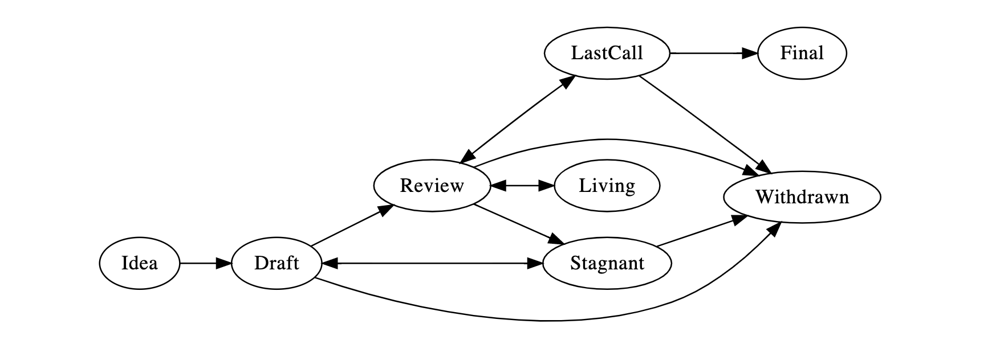

## What is an TIP?

TIP stands for TON Improvement Proposal. An TIP is a design document providing information to the TON community, or describing a new feature for TON or its processes or environment. The TIP should provide a concise technical specification of the feature and a rationale for the feature. The TIP author is responsible for building consensus within the community and documenting dissenting opinions.

## TIP Rationale

We intend TIPs to be the primary mechanisms for proposing new features, for collecting community technical input on an issue, and for documenting the design decisions that have gone into TON. Because the TIPs are maintained as text files in a versioned repository, their revision history is the historical record of the feature proposal.

For TON implementers, TIPs are a convenient way to track the progress of their implementation. Ideally each implementation maintainer would list the TIPs that they have implemented. This will give end users a convenient way to know the current status of a given implementation or library.

## TIP Types

There are three types of TIP:

- **TRC**: application-level standards and conventions, including contract standards such as token standards, name registries, URI schemes, library/package formats, and wallet formats.
- **Core**: improvements requiring a consensus fork, as well as changes that are not necessarily consensus critical but may be relevant to core, and the miner/node strategy changes
- **Networking**: includes improvements around network protocol specifications.
- **Interface**: includes improvements around client [API/RPC] specifications and standards, and also certain language-level standards like method names and contract ABIs.
- A **Meta TIP** describes a process surrounding TON or proposes a change to (or an event in) a process. Process TIPs are like other TIPs but apply to areas other than the TON protocol itself. They may propose an implementation, but not to TON's codebase; they often require community consensus; unlike Informational TIPs, they are more than recommendations, and users are typically not free to ignore them. Examples include procedures, guidelines, changes to the decision-making process, and changes to the tools or environment used in TON development.
- An **Informational TIP** describes an TON design issue, or provides general guidelines or information to the TON community, but does not propose a new feature. Informational TIPs do not necessarily represent TON community consensus or a recommendation, so users and implementers are free to ignore Informational TIPs or follow their advice.

It is highly recommended that a single TIP contain a single key proposal or new idea. The more focused the TIP, the more successful it tends to be. A change to one client doesn't require an TIP; a change that affects multiple clients, or defines a standard for multiple apps to use, does.

An TIP must meet certain minimum criteria. It must be a clear and complete description of the proposed enhancement. The enhancement must represent a net improvement. The proposed implementation, if applicable, must be solid and must not complicate the protocol unduly.

## TIP Work Flow

### Shepherding an TIP

Before you begin writing a formal TIP, you should vet your idea. Ask the TON community first if an idea is original to avoid wasting time on something that will be rejected based on prior research. It is thus recommended to open a discussion thread on [the freeTON forum] to do this, but you can also use [the Issues section of this repository]. 

Once the idea has been vetted, your next responsibility will be to present (by means of an TIP) the idea to the reviewers and all interested parties, invite editors, developers, and the community to give feedback on the aforementioned channels. You should try and gauge whether the interest in your TIP is commensurate with both the work involved in implementing it and how many parties will have to conform to it. For example, the work required for implementing a Core TIP will be much greater than for an TRC and the TIP will need sufficient interest from the TON teams. Negative community feedback will be taken into consideration and may prevent your TIP from moving past the Draft stage.

### TIP Process 

The following is the standardization process for all TIPs in all tracks:

**Idea** - An idea that is pre-draft. This is not tracked within the TIP Repository.

**Draft** - The first formally tracked stage of an TIP in development. An TIP is merged by an TIP Editor into the TIP repository when properly formatted.

**Review** - An TIP Author marks an TIP as ready for and requesting Peer Review.

**Last Call** - This is the final review window for an TIP before moving to `FINAL`. An TIP editor will assign `Last Call` status and set a review end date (review-period-end), typically 14 days later.

If this period results in necessary normative changes it will revert the TIP to `REVIEW`.

**Final** - This TIP represents the final standard. A Final TIP exists in a state of finality and should only be updated to correct errata and add non-normative clarifications.

**Stagnant** - Any TIP in `DRAFT` or `REVIEW` if inactive for a period of 6 months or greater is moved to `STAGNANT`. An TIP may be resurrected from this state by Authors or TIP Editors through moving it back to `DRAFT`.

**Withdrawn** - The TIP Author(s) have withdrawn the proposed TIP. This state has finality and can no longer be resurrected using this TIP number. If the idea is pursued at later date it is considered a new proposal.

**Living** - A special status for TIPs that are designed to be continually updated and not reach a state of finality. This includes most notably TIP-1. Any changes to these TIPs will move between `REVIEW` and `LIVING` states.

## What belongs in a successful TIP?

Each TIP should have the following parts:

- Preamble - RFC 822 style headers containing metadata about the TIP, including the TIP number, a short descriptive title (limited to a maximum of 44 characters), and the author details. See [below](./eip-1.md#eip-header-preamble) for details.
- Abstract - A short (~200 word) description of the technical issue being addressed.
- Motivation (*optional) - A motivation section is critical for TIPs that want to change the TON protocol. It should clearly explain why the existing protocol specification is inadequate to address the problem that the TIP solves. TIP submissions without sufficient motivation may be rejected outright.
- Specification - The technical specification should describe the syntax and semantics of any new feature. The specification should be detailed enough to allow competing, interoperable implementations.
- Rationale - The rationale fleshes out the specification by describing what motivated the design and why particular design decisions were made. It should describe alternate designs that were considered and related work, e.g. how the feature is supported in other languages. The rationale may also provide evidence of consensus within the community, and should discuss important objections or concerns raised during discussion.
- Backwards Compatibility - All TIPs that introduce backwards incompatibilities must include a section describing these incompatibilities and their severity. The TIP must explain how the author proposes to deal with these incompatibilities. TIP submissions without a sufficient backwards compatibility treatise may be rejected outright.
- Test Cases - Test cases for an implementation are mandatory for TIPs that are affecting consensus changes. Tests should either be inlined in the TIP as data (such as input/expected output pairs, or included in `../assets/eip-###/<filename>`.
- Reference Implementation - An optional section that contains a reference/example implementation that people can use to assist in understanding or implementing this specification.
- Copyright Waiver - All TIPs must be in the public domain. See the bottom of this TIP for an example copyright waiver.

## TIP Formats and Templates

TIPs should be written in [markdown] format. There is a [template](https://github.com/ethereum/TIPs/blob/master/eip-template.md) to follow.

## TIP Header Preamble

Each TIP must begin with an [RFC 822](https://www.ietf.org/rfc/rfc822.txt) style header preamble, preceded and followed by three hyphens (`---`). The headers must appear in the following order. Headers marked with "*" are optional and are described below. All other headers are required.

` eip:` *TIP number* (this is determined by the TIP editor)

` title:` *TIP title*

` author:` *a list of the author's or authors' name(s) and/or username(s), or name(s) and email(s). Details are below.*

` * discussions-to:` *a url pointing to the official discussion thread*

` status:` *Draft, Review, Last Call, Final, Stagnant, Withdrawn, Living*

`* review-period-end:` *date review period ends*

` type:` *TRC, Core, Networking, Interface, Meta, Informational*

` * category:` *Core, Networking, Interface, or ERC* (fill out for Standards Track TIPs only)

` created:` *date created on*

` * updated:` *comma separated list of dates*

` * requires:` *TIP number(s)*

` * replaces:` *TIP number(s)*

` * superseded-by:` *TIP number(s)*

` * resolution:` *a url pointing to the resolution of this TIP*

Headers that permit lists must separate elements with commas.

Headers requiring dates will always do so in the format of ISO 8601 (yyyy-mm-dd).

#### `author` header

The `author` header lists the names, email addresses or usernames of the authors/owners of the TIP. Those who prefer anonymity may use a username only, or a first name and a username. The format of the `author` header value must be:

> Random J. User &lt;address@dom.ain&gt;

or

> Random J. User (@username)

if the email address or GitHub username is included, and

> Random J. User

if the email address is not given.

It is not possible to use both an email and a GitHub username at the same time. If important to include both, one could include their name twice, once with the GitHub username, and once with the email.

At least one author must use a GitHub username, in order to get notified on change requests and have the capability to approve or reject them.

#### `resolution` header

It contains a URL that should point to an email message or other web resource where the pronouncement about the TIP is made.

#### `discussions-to` header

While an TIP is a draft, a `discussions-to` header will indicate the mailing list or URL where the TIP is being discussed. As mentioned above, examples for places to discuss your TIP include an issue in this repo or in a fork of this repo, [freeTON forum](https://forum.freeton.org/) (this is suitable for TIPs that may be contentious or have a strong governance aspect).

No `discussions-to` header is necessary if the TIP is being discussed privately with the author.

As a single exception, `discussions-to` cannot point to GitHub pull requests.

#### `type` header

The `type` header specifies the type of TIP: *TRC, Core, Networking, Interface, Meta, Informational*.

#### `created` header

The `created` header records the date that the TIP was assigned a number. Both headers should be in yyyy-mm-dd format, e.g. 2001-08-14.

#### `updated` header

The `updated` header records the date(s) when the TIP was updated with "substantial" changes. This header is only valid for TIPs of Draft and Active status.

#### `requires` header

TIPs may have a `requires` header, indicating the TIP numbers that this TIP depends on.

#### `superseded-by` and `replaces` headers

TIPs may also have a `superseded-by` header indicating that an TIP has been rendered obsolete by a later document; the value is the number of the TIP that replaces the current document. The newer TIP must have a `replaces` header containing the number of the TIP that it rendered obsolete.

## Linking to other TIPs

References to other TIPs should follow the format `TIP-N` where `N` is the TIP number you are referring to.  Each TIP that is referenced in an TIP **MUST** be accompanied by a relative markdown link the first time it is referenced, and **MAY** be accompanied by a link on subsequent references.  The link **MUST** always be done via relative paths so that the links work in this GitHub repository, forks of this repository, the main TIPs site, mirrors of the main TIP site, etc.  For example, you would link to this TIP with `[TIP-1](./eip-1.md)`.

## Auxiliary Files

Images, diagrams and auxiliary files should be included in a subdirectory of the `assets` folder for that TIP as follows: `assets/eip-N` (where **N** is to be replaced with the TIP number). When linking to an image in the TIP, use relative links such as `../assets/eip-1/image.png`.

## Style Guide

When referring to an TIP by number, it should be written in the hyphenated form `TIP-X` where `X` is the TIP's assigned number.

## History

This document was derived heavily from [Bitcoin's BIP-0001] written by Amir Taaki which in turn was derived from [Python's PEP-0001]. In many places text was simply copied and modified. Although the PEP-0001 text was written by Barry Warsaw, Jeremy Hylton, and David Goodger, they are not responsible for its use in the TON Improvement Process, and should not be bothered with technical questions specific to TON or the TIP. Please direct all comments to the TIP editors.

### Bibliography

[ton Docs]: https://docs.ton.dev/
[API/RPC]: https://docs.ton.dev/86757ecb2/p/39fc5e-products
[TON whitepaper]: https://ton.org/ton.pdf
[pull request]: https://github.com/Open-FreeTON/TIPs/pulls
[formal specification]: https://ton.org/tvm.pdf
[the Issues section of this repository]: https://github.com/Open-FreeTON/TIPs/issues
[markdown]: https://github.com/adam-p/markdown-here/wiki/Markdown-Cheatsheet
[Bitcoin's BIP-0001]: https://github.com/bitcoin/bips
[Python's PEP-0001]: https://www.python.org/dev/peps/
[the freeTON forum]: https://forum.freeton.org/
## Copyright

Copyright and related rights waived via [CC0](https://creativecommons.org/publicdomain/zero/1.0/).